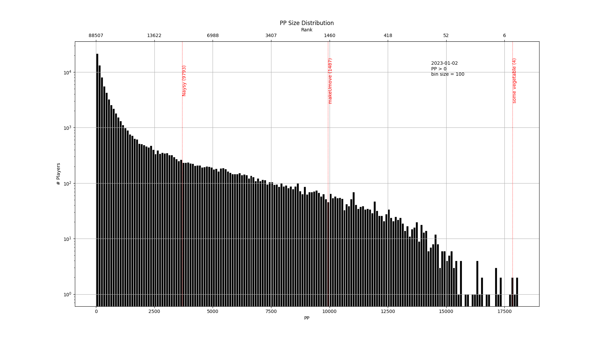

# ScoreSaber Histogram - Graph All the PP!

The below is best done in a virtual environment:

```
pip install -r requirements.txt
./fetch_scores.py  # or unpack an existing dataset -- you'll need `zstd` for that
# generate a histogram with markers for Naysy, Bandoot, makeUmove, cerret
./make_histogram.py -u 76561198025079840 -u 76561198009689541 -u 76561198153055189 -u 76561198333869741
```



